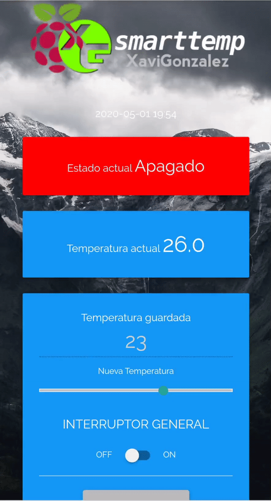

# raspitemp
Thermostat Raspberry Flask web app

Esta es una aplicación web Flask para simular un termostato conectado a través de rele, con un sensor de temperatura DHT11.
This is a Flask web app to simulate a thermostat connected via rele, with a temperature sensor DHT11.

Para ver más información sobre como instalar esta aplicación visita:
To see more information on how to install this application visit:
https://blog.xavigonzalez.net/termostato-inteligente-con-raspberry-pi/

 Esta obra está bajo una <a rel="license" href="http://creativecommons.org/licenses/by/4.0/">Licencia Creative Commons Atribución 4.0 Internacional</a>.
